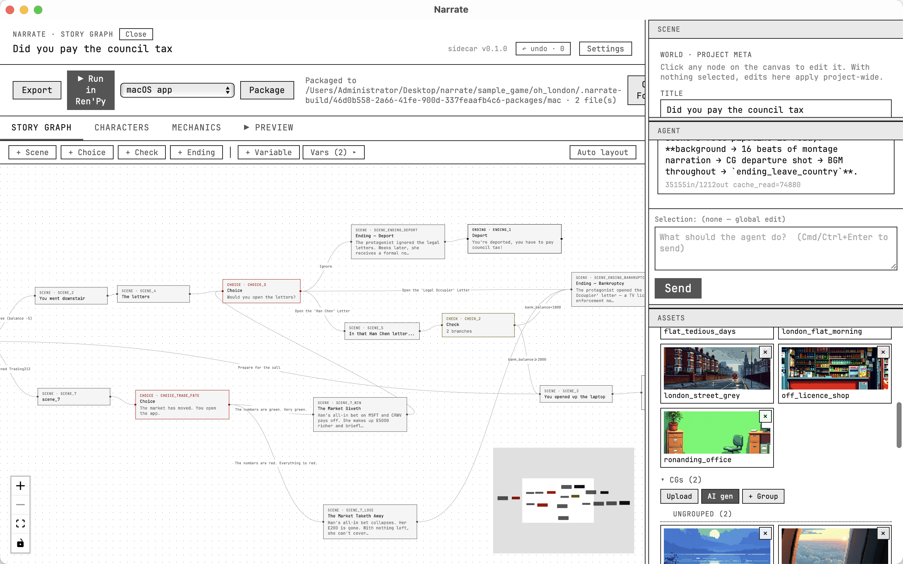
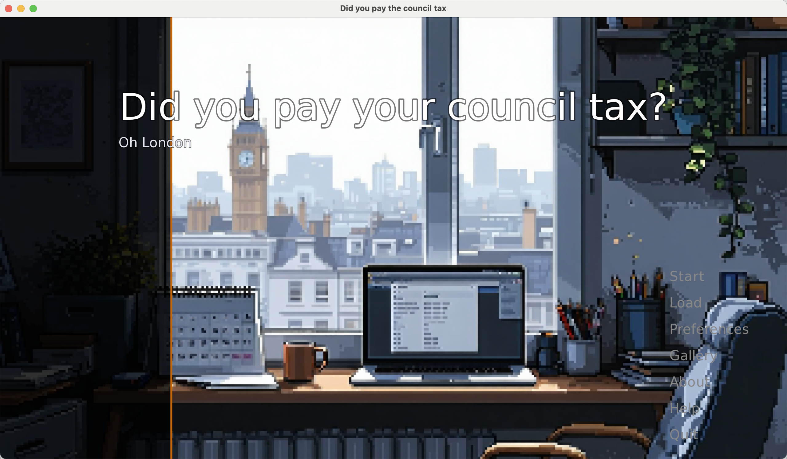
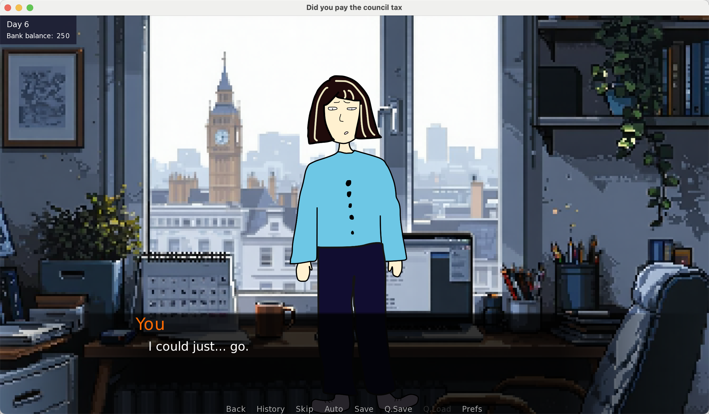
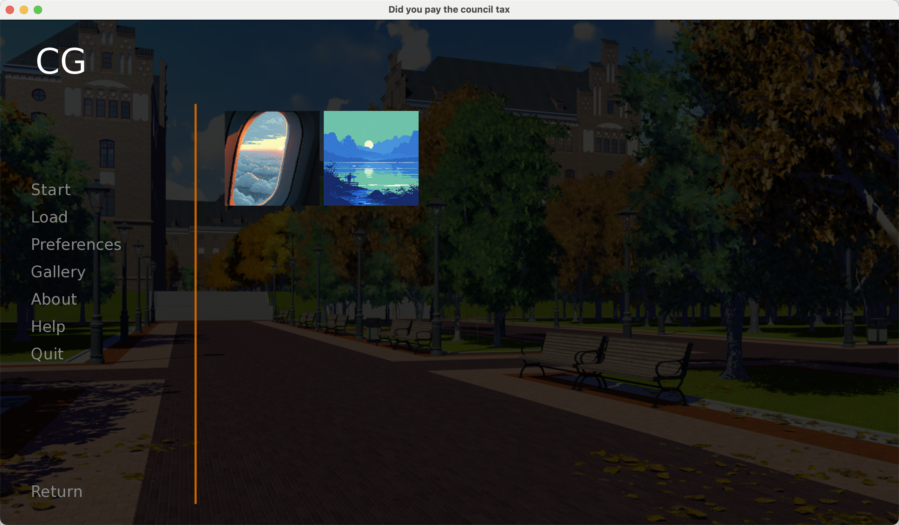
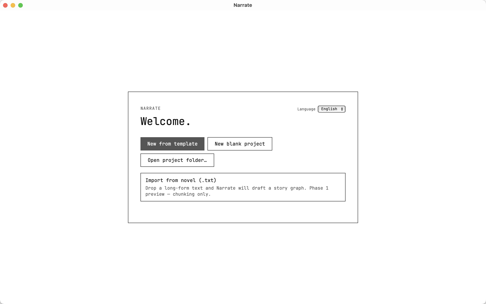

# Narrate

_(:з」∠) I made a text-based game editor called Narrate.

Friends who know me may know that, for the past few years, I’ve been living very tightly attached to the metaphor that “life is a finite binary tree.” You can read books, bleed for your career, go home, or wander even farther away. I sometimes felt that life is too much like a spindle with the seemingly infinite possibilities blooming and splitting apart, only to eventually converge to one ending. From where, anything in between will just conceptually collapse. 

I still haven’t figured out how to crawl out of this deadly tree, but I began exploring other people’s lives, I dug the past of my friends and the passengers I met in trips. Then I thought to solidify this analogy, I was just too curious about what potential 'alter-lives' people may narrate on from the wilted branches. That was the beginning of Narrate.

In Narrate, you can create a text-based game (or visual novel), you may serve your LLM APIs to generate background music, CGs, characters, or expand the plot and worldbuilding. Of course, you can also use it entirely without any LLM :')

You can use it to contract or expand worldlines, and attach a die to each decision point so that fate becomes random. I connected it to an LLM interface, so you can use it to generate background music, CGs, characters, or expand the plot and worldbuilding.

Narrate will then package your game, so you can invite friends and family to play the text-based game you created.

Below is a small chapter I wrote in Narrate about the minor disasters of my first year in London.

Narrate supports mechanics such as time settings, intimacy levels, random choices, item inventories, and more.

To be honest, I made it entirely because after listening to a friend talk about how hard it was to move through their life, I was suddenly struck by the desire to simulate their life and choices. Of course, it can also be used for OC creation or fanwork!

As for the built-in LLM, I added it because I wanted to reduce the skill barrier involved in creating text-based games as much as possible. It should be a form of expression, and an invitation: “please come explore my world.” But I also don’t want AI to run wild and completely erase the creator’s personality, or to infringe on other artists’ styles through image blending. For now, my compromise is that Narrate is strictly instructed to generate pixel-art assets only…

Open-source repo: [https://github.com/jiezhao2002/narrate]
Mac installer: [https://github.com/jiezhao2002/narrate/tree/master/download/mac]
Try the sample game “Have You Paid Your Council Tax?”: [https://github.com/jiezhao2002/narrate/tree/master/download/sample_game]

## 碎碎念

_(:з」∠) 我做了一个文字游戏编辑器，叫Narrate。

其实认识我的朋友可能知道这几年我一直紧紧依附着“生活是有穷的二叉树”这样的隐喻生活，你可以读书、可以为职业流血、可以回家或者走向更遥远的远方。痛苦的时候我觉得人生太像纺锤，蓬发又裂解的貌似无穷的可能，最后收束向一个结局。我仍然没想明白人生应该怎么办，于是我开始探究别人的人生。这是Narrate的开始。

你可以在Narrate中创建一个文字游戏，然后用它来生成背景音乐、CG、角色，或者扩展情节/世界观，当然也可以完全不用LLM！

你可以用它收束或者展开世界线，给每个选项贴个骰子使得命运随机。我给它连了LLM接口，你可以用它来生成背景音乐、CG、角色，或者扩展情节/世界观，当然也可以完全不用LLM！

然后Narrate会打包好你的游戏，你可以诚邀别的亲友来玩你创造的文游。

以下是我用Narrate写的伦敦生活窘境小节，点击即玩。

Narrate支持设置时间、亲密度、随机选项、物品背包等机制。

其实做它完全出于听完朋友举步维艰的故事之后，油然而生的一种“我想来模拟你的人生和抉择”的愿望。当然它也可以用来做OC或者同人创作！

关于内置LLM，其实是因为我想尽量消减创作文字游戏的技能负担，它应该是一种表达和“请来探索我的世界”的邀请；但我也不想让AI策马狂奔完全抹消创作者的性格，或者溶图侵犯其他画师的风格。目前折衷的办法是，我给Narrate设定了强制只生成像素图像素材的命令…

开源repo在：[https://github.com/jiezhao2002/narrate]
Mac安装包在: [https://github.com/jiezhao2002/narrate/tree/master/download/mac]
试玩”你交council tax了吗“: [https://github.com/jiezhao2002/narrate/tree/master/download/sample_game]

